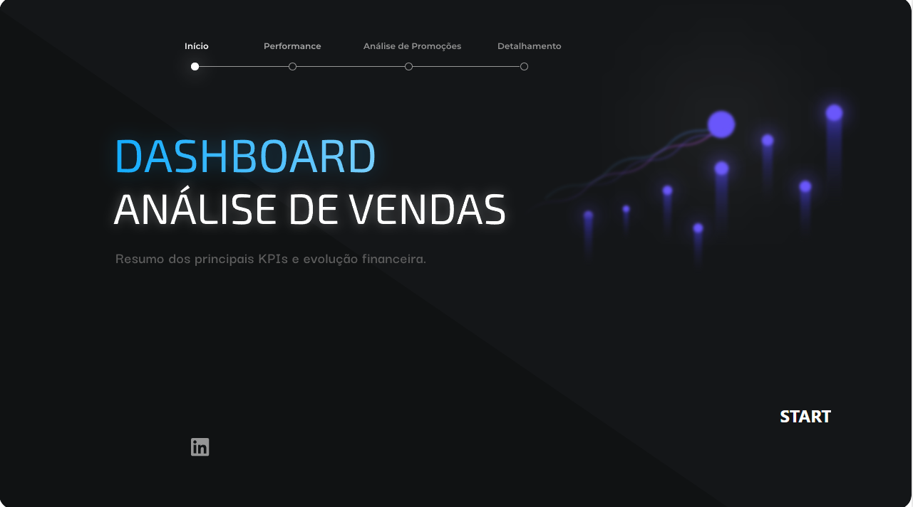
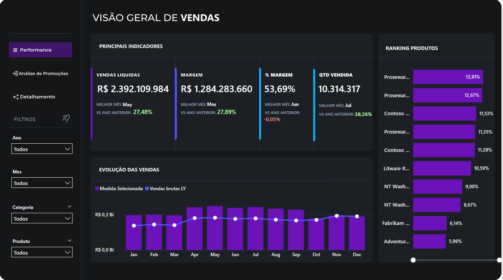
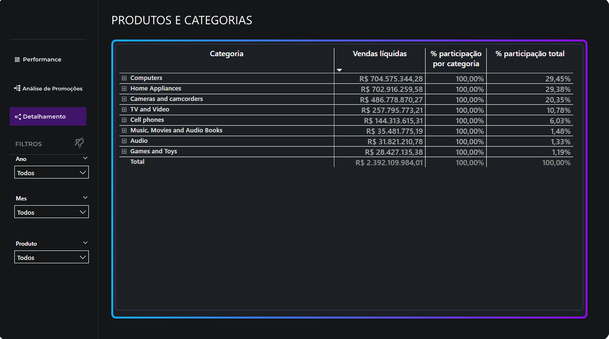

# 📊 Dashboard de Análise de Vendas e Promoções

Este projeto é um dashboard executivo desenvolvido em Power BI para analisar a performance de vendas, impacto de descontos e margem de lucro de uma empresa de varejo.

## 🎯 Objetivo do Projeto
Responder a perguntas de negócio complexas, como:
- Quais promoções realmente funcionam?
- Os descontos estão impactando positivamente a receita?
- Qual a participação de cada produto no faturamento total?

## 🛠️ Tecnologias e Técnicas Utilizadas
- **Power BI:** Modelagem de dados, criação de medidas complexas em DAX e visualização.
- **DAX:** Inteligência de tempo (LY, YTD), manipulação de contexto de filtro (ALL, CALCULATE), funções iteradoras (MAXX, TOPN).
- **Design/Front-end:** Navegação de páginas via botões invisíveis, formatação condicional, background personalizado.
- **Segurança:** Row-Level Security (RLS) aplicado por país.

## 📸 Imagens do Projeto

## 📂 Como acessar

Você pode visualizar o relatório completo em formato PDF [clicando aqui](dashboard-vendas-powerbi.pdf) ou baixar o arquivo `.pbix` para interagir com os dados no Power BI Desktop.
